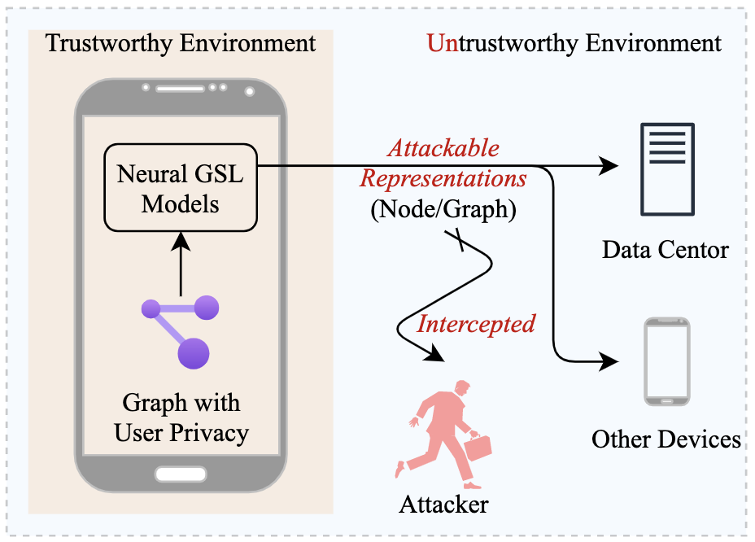

# PPGM

This is the official PyTorch implementation for the paper:
> Yupeng Hou, Wayne Xin Zhao, Yaliang Li, Ji-Rong Wen. Privacy-Preserved Neural Graph Similarity Learning. ICDM 2022.

<div  align="center"> 

</div>

## Requirements

```
python==3.7
pytorch==1.11.0
pyg==2.0.4
cudatoolkit==11.3.1
```

## Dataset

Please refer to https://github.com/ryderling/MGMN/tree/main/data.

## Reproduction

### Graph-Graph Classification

```bash
python src/cfg_train.py --dataset DATASET --graph_size_min SIZE
```

* `DATASET` can be `ffmpeg` or `OpenSSL`;
* `SIZE` can be `20` or `50`.

### Property Inference Attack

```bash
python src/cfg_inf.py --dataset DATASET --graph_size_min SIZE --model_path PATH
```

* `DATASET` can be `ffmpeg` or `OpenSSL`;
* `SIZE` can be `20` or `50`;
* `PATH` is the path of trained classification model.

### Acknowledgement

Please cite our paper as the reference if you use our codes or the processed datasets.

```bibtex
@inproceedings{hou2022ppgm,
  author = {Yupeng Hou and Wayne Xin Zhao and Yaliang Li and Ji-Rong Wen},
  title = {Privacy-Preserved Neural Graph Similarity Learning},
  booktitle = {{ICDM}},
  year = {2022}
}
```
